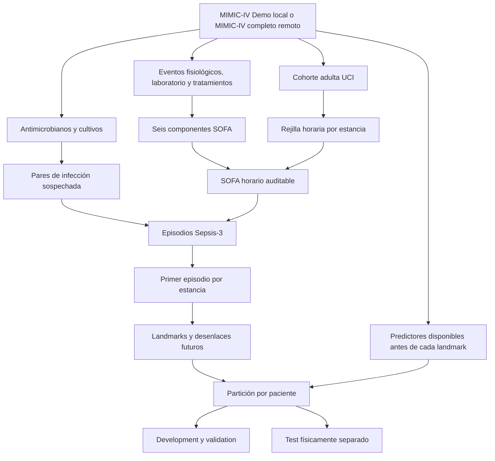

# Guía narrativa del proyecto

## 1. Qué es este repositorio

Este repositorio contiene el trabajo reproducible para desarrollar y validar
internamente modelos que estimen el riesgo de sepsis y shock séptico en
pacientes adultos de UCI usando MIMIC-IV. La intención posterior es estudiar
su transportabilidad a cohortes españolas vinculadas a SEMICYUC.

El proyecto se encuentra todavía en desarrollo metodológico. Ya construye una
cohorte adulta auditable, sospecha de infección, SOFA horario, etiquetas
retrospectivas Sepsis-3/shock, landmarks futuros y matrices temporales sobre
MIMIC-IV Demo. Todavía no existe un modelo final,
una validación externa ni autorización para uso asistencial. Nada de este
repositorio debe emplearse para diagnosticar, tratar o generar alertas clínicas.

Esta guía es la puerta de entrada para una persona que no haya participado en
el desarrollo. Resume qué pregunta se intenta responder, cómo fluye la
información, qué decisiones están cerradas, cómo reproducir el estado actual y
dónde encontrar el detalle técnico.

## 2. La pregunta de investigación

La pregunta principal prevista es:

> Entre pacientes adultos ingresados en UCI que aún no han desarrollado el
> desenlace, ¿qué probabilidad existe de que aparezca Sepsis-3 en las próximas
> seis horas usando solamente información disponible antes del instante de
> predicción?

El proyecto separa tres problemas que no deben confundirse:

1. **Fenotipado retrospectivo:** reconstruir de forma reproducible cuándo un
   episodio cumple una definición operacional de Sepsis-3.
2. **Predicción:** estimar un riesgo futuro desde landmarks horarios sin usar
   información posterior.
3. **Evaluación clínica:** estudiar calibración, discriminación, utilidad y
   transportabilidad. Un buen rendimiento retrospectivo no demuestra beneficio
   clínico.

Shock séptico es un segundo desenlace. Existe un proxy provisional basado en
vasopresor y lactato >2 mmol/L; cómo representar resucitación adecuada con
fluidos continúa pendiente y se evaluará como sensibilidad.

## 3. Fuente de datos y límites de uso

La fuente principal es MIMIC-IV. Durante el desarrollo local se usa
**MIMIC-IV Demo v2.2**, que contiene una muestra pequeña destinada a comprobar
que el código funciona. El análisis completo está previsto para
**MIMIC-IV v3.1** en un equipo con más memoria y almacenamiento.

El demo permite probar esquemas, enlaces, ventanas temporales y casos frontera.
No permite entrenar un modelo útil, estimar prevalencias fiables ni evaluar su
rendimiento. Las cifras que produzca deben interpretarse como controles de
ingeniería, no como resultados clínicos.

MIMIC-IV es de acceso controlado. Cada investigador debe usar sus propias
credenciales de PhysioNet y cumplir el acuerdo de uso. Los datos, credenciales,
identificadores, fechas desplazadas y artefactos a nivel de paciente nunca se
suben a GitHub. Véanse las normas completas en [`AGENTS.md`](../AGENTS.md).

## 4. Cómo se construye el fenotipo

### 4.1 Sospecha de infección

La definición primaria combina una administración confirmada de un
antimicrobiano sistémico con la toma de un cultivo de sangre:

- antimicrobiano primero y cultivo dentro de las 24 horas siguientes; o
- cultivo primero y antimicrobiano dentro de las 72 horas siguientes.

`t_si` es el tiempo del primero de ambos eventos. `t_si_confirmed_at` es el
tiempo del segundo: el momento en que el par ya puede confirmarse. Conservar
ambos evita presentar retrospectivamente como conocida una infección que aún
no era observable.

La clasificación farmacológica se encuentra en
[`config/antimicrobial_rules.csv`](../config/antimicrobial_rules.csv). Es
provisional hasta su revisión clínica antes del análisis completo.

### 4.2 SOFA horario

Se calculan los seis componentes de SOFA: respiratorio, coagulación, hígado,
cardiovascular, sistema nervioso central y riñón. Para cada hora `e`, cada
componente representa su peor valor elegible en `(e-24 h, e]`.

Se conservan dos totales:

- `sofa_total`: convención compatible con MIMIC, con componentes ausentes a
  cero;
- `sofa_complete`: disponible únicamente si están observados los seis
  componentes.

También se guarda cuántos componentes faltan. Puntuar un ausente como cero es
una convención de fenotipado, no evidencia de función orgánica normal.

### 4.3 Sepsis-3

La definición primaria está congelada en
[`config/sepsis3.json`](../config/sepsis3.json):

- baseline: mínimo `sofa_total` horario observado en `[t_si-48 h, t_si)`;
- si no existe hora basal, se presume cero y se marca explícitamente;
- ventana aguda: `[t_si-24 h, t_si+24 h]`, incluidos ambos extremos;
- Sepsis-3: primer incremento de SOFA igual o superior a dos puntos;
- `t0`: hora del primer cruce, no la hora del máximo posterior;
- `label_available_at = max(t0, t_si_confirmed_at)`.

La etiqueta es retrospectiva. `t0` estima inicio clínico, mientras que
`label_available_at` permite auditar cuándo estaba confirmada. Ninguno de esos
campos, ni los identificadores del par, puede entrar como predictor.

El detalle y los casos ambiguos están en
[`sepsis_definition.md`](sepsis_definition.md) y
[`sofa_infection_integration.md`](sofa_infection_integration.md).

## 5. Flujo completo de información



Las ramas de etiquetas y predictores permanecen separadas hasta construir el
conjunto de modelado. Esta separación es un control central contra fuga de
información.

## 6. Organización del repositorio

| Ruta | Función |
|---|---|
| `config/` | Decisiones ejecutables no sensibles y listas clínicas versionadas. |
| `docs/` | Protocolo, definiciones, decisiones, estrategia y esta guía. |
| `notebooks/` | Recorrido visible y secuencial del análisis. |
| `scripts/` | Descarga del demo y construcción automatizada de artefactos. |
| `src/mimic_sepsis/` | Lógica reutilizable y probada; no se duplica en notebooks. |
| `tests/` | Fixtures sintéticos, fronteras temporales e invariantes. |
| `data/` | Datos y derivados locales protegidos; está excluido de Git. |

Los módulos principales son:

- `cohort.py`: población y políticas de selección de estancias;
- `antimicrobials.py` e `infection.py`: fármacos, administración y pares;
- `sofa*.py`: normalización, componentes y composición horaria;
- `sepsis_labels.py`: enlace temporal entre infección y SOFA;
- `landmarks.py` y `splits.py`: conjuntos de riesgo, censura y separación por paciente;
- `feature_sources.py` y `features.py`: disponibilidad y agregación temporal de predictores;
- `artifacts.py`: Parquet atómico, manifiestos, hashes y validación;
- `db.py` y `config.py`: conexión de solo lectura al MIMIC remoto.

DuckDB se usa como motor local para inspeccionar CSV/Parquet y validar
artefactos sin cargar una base de datos completa. La lógica clínica se
implementa con funciones de Python/pandas probadas. En el servidor completo,
PostgreSQL y SQL versionado asumirán la extracción pesada; DuckDB no es un
requisito conceptual del modelo.

## 7. Recorrido de notebooks

Los notebooks se ejecutan en orden numérico desde un kernel limpio. Su
manifiesto canónico es [`notebooks/README.md`](../notebooks/README.md).

| Paso | Resultado |
|---:|---|
| 00 | Descarga y verificación del demo. |
| 01 | Inventario y relaciones de tablas. |
| 02 | Perfil agregado preliminar. |
| 03 | Definición y auditoría de cohorte. |
| 04 | Pares de infección sospechada. |
| 05 | Clasificación y confirmación EMAR de antimicrobianos. |
| 06 | Disponibilidad de fuentes y umbrales SOFA. |
| 07 | SOFA horario, Sepsis-3 y resultados agregados. |
| 08 | Auditoría agregada inicial del fenotipo. |
| 09 | Landmarks, particiones, cobertura y características leakage-safe. |
| 10 | Referencias de prevalencia y regresión clínica con validación agrupada. |
| 11 | Comparación pareada e intervalos por bootstrap de pacientes completos. |
| 12 | Sensibilidades de cohorte, horizonte y lookback. |
| 13 | Informe reproducible; pendiente. |

Python se usa para datos y modelos. R y `ggplot2` constituyen el estándar de
las figuras analíticas y publicables. El notebook 07 incluye una comparación
metodológica puntual con Matplotlib usando exactamente el mismo agregado.

## 8. Reproducción local desde cero

### 8.1 Entorno

La forma recomendada es crear el entorno combinado Python/R descrito en
`environment.yml`:

```bash
micromamba create -f environment.yml
micromamba activate semicyuc-mimic-sepsis
```

Como alternativa exclusivamente Python:

```bash
python -m venv .venv
source .venv/bin/activate
pip install -e '.[analysis,dev]'
```

La alternativa Python no instala R ni permite reproducir las figuras ggplot2.

### 8.2 Demo y pruebas

```bash
python scripts/download_mimic_demo.py
pytest -q
python scripts/build_demo_sofa_incremental.py --stage all
```

La última orden crea una ejecución bajo:

```text
data/derived/sofa/<run_id>/
├── 00_cohort/
├── 20_components/
├── 30_score/
├── 40_labels/
├── 50_landmarks/   # un artefacto por target y partición
└── 60_features/    # matrices predictoras sin outcomes
```

Para reanudar sin recalcular artefactos válidos:

```bash
python scripts/build_demo_sofa_incremental.py --stage all --resume
```

Cada Parquet tiene un manifiesto JSON con checksum SHA-256, esquema, número de
filas, versión de datos, versión de código y hash de configuración. Un archivo
corrupto o incompatible no se reutiliza silenciosamente.

### 8.3 Jupyter

Desde la raíz del repositorio:

```bash
jupyter lab
```

Se abren los notebooks en orden 00–12. Deben ejecutarse desde un kernel limpio;
los archivos versionados no conservan outputs ni datos clínicos embebidos.

## 9. Conexión al MIMIC-IV completo

El demo es local. Para el análisis definitivo se prevé acceso remoto de solo
lectura a PostgreSQL o una descarga autorizada en el servidor de cálculo.

1. Copiar `config/mimic.env.example` a `config/mimic.env`.
2. Completar localmente host, puerto, base, usuario y contraseña.
3. Exportar las variables de entorno antes de iniciar Jupyter.
4. Ejecutar primero únicamente la comprobación de acceso y esquemas.

```bash
cp config/mimic.env.example config/mimic.env
set -a
source config/mimic.env
set +a
jupyter lab
```

`config/mimic.env` está ignorado por Git. No se escribe la contraseña en una
celda, una URL compartida, el historial del shell ni un argumento de línea de
comandos. La descarga desde PhysioNet debe pedirla interactivamente mediante
`--ask-password` y solo puede realizarla un usuario autorizado.

Antes de escalar se comprobarán espacio disponible, versión exacta, esquemas,
índices, permisos de solo lectura y compatibilidad con MIMIC Code. Los
artefactos incrementales permiten ejecutar por etapas y reanudar en el equipo
de mayor capacidad.

## 10. Cómo interpretar el estado actual

El pipeline del demo ya produce artefactos íntegros de cohorte, seis
componentes SOFA, total horario, pares de infección y episodios Sepsis-3. Las
pruebas cubren unidades, umbrales, ventanas inclusivas/exclusivas, ausencia de
vasopresores, múltiples estancias, falta de baseline y primer cruce SOFA.

Los recuentos del demo no deben citarse como incidencia o prevalencia. En
particular:

- un par antimicrobiano–cultivo no equivale a una infección independiente;
- varios pares pueden corresponder al mismo episodio o estancia;
- la ausencia de un componente SOFA no significa normalidad;
- la cobertura incompleta de la rejilla puede cambiar la evaluabilidad;
- MIMIC-IV procede de un único sistema sanitario estadounidense y no demuestra
  transportabilidad a España.

El notebook 07 muestra únicamente agregados para detectar errores de magnitud,
missingness y cronología. La revisión clínica de listas y distribuciones debe
preceder al análisis completo.

## 11. Prevención de leakage

Para cada futuro ejemplo predictivo existirán un landmark `L`, una ventana de
observación y un horizonte `H`. Las reglas esenciales son:

- los predictores usan eventos clínicamente disponibles antes de `L`;
- no se usan cultivos positivos, duración posterior del tratamiento,
  diagnósticos de alta ni resúmenes de toda la estancia;
- los eventos que definen la etiqueta se mantienen en una tabla separada;
- ningún `subject_id` aparece en más de una partición;
- imputación, escalado, selección y calibración se ajustan solo en training y
  dentro de cada fold;
- el test final permanece bloqueado hasta congelar fenotipo, features y modelos.

El horizonte primario es 6 h y su intervalo es `(L,L+6 h]`; esta convención
está congelada en D009/D012 y cubierta por pruebas de frontera.

## 12. Calidad, revisión y cambios metodológicos

Antes de aceptar un cambio se exige, en proporción a su riesgo:

1. prueba sintética de la lógica y sus fronteras temporales;
2. suite completa sin fallos;
3. documentación y configuración coherentes;
4. revisión de archivos no rastreados y outputs de notebooks;
5. ausencia de datos, credenciales y artefactos protegidos en Git;
6. regeneración de manifiestos cuando cambie la definición.

El índice oficial es [`decision_register.md`](decision_register.md). Cada
decisión tiene un ID y un estado. Las alternativas no sustituyen
silenciosamente a la definición primaria: se incorporan como análisis de
sensibilidad o como una nueva versión explícita.

## 13. Qué falta

Los siguientes hitos continúan abiertos:

- auditoría clínica final del listado antimicrobiano y alcance de cultivos;
- criterio de cobertura mínima para episodios SOFA;
- revisión clínica del proxy de shock séptico y sensibilidades de fluidos/MAP;
- partición por paciente y cálculo formal de tamaño muestral;
- congelación del conjunto primario, regresión penalizada y gradient boosting;
- calibración ampliada, utilidad clínica y subgrupos;
- ejecución sobre MIMIC-IV completo y validación externa.

## 14. Mapa de lectura recomendado

Una revisión externa puede seguir este orden:

1. esta guía;
2. [`protocol.md`](protocol.md);
3. [`decision_register.md`](decision_register.md);
4. [`sepsis_definition.md`](sepsis_definition.md);
5. [`modeling_strategy.md`](modeling_strategy.md);
6. [`variable_dictionary.md`](variable_dictionary.md);
7. [`notebooks/README.md`](../notebooks/README.md) y notebooks 00–12;
8. tests correspondientes antes de revisar la implementación clínica.

Para detalles de ingeniería de SOFA y almacenamiento:
[`mimic_code_sofa_plan.md`](mimic_code_sofa_plan.md),
[`sofa_demo_inventory.md`](sofa_demo_inventory.md) y
[`derived_artifacts.md`](derived_artifacts.md).

## 15. Glosario breve

- **Artefacto:** tabla derivada persistida con manifiesto y checksum.
- **Baseline SOFA:** referencia preinfección usada para calcular el incremento.
- **Fenotipo:** definición operacional que transforma datos observacionales en
  una etiqueta de investigación.
- **Landmark:** instante desde el que se emite una predicción.
- **Leakage:** uso directo o indirecto de información que no estaba disponible
  al realizar la predicción.
- **MIMIC Code:** conceptos y consultas de referencia asociados a MIMIC.
- **SOFA:** Sequential Organ Failure Assessment.
- **`t_si`:** inicio estimado de sospecha de infección.
- **`t0`:** primer momento en que el incremento SOFA alcanza el umbral.
- **`label_available_at`:** momento en que la etiqueta retrospectiva ya puede
  confirmarse con los datos observados.
